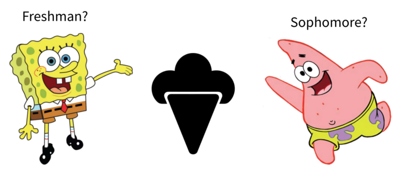
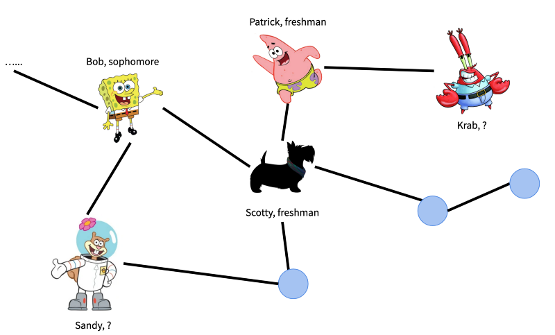

# Freshman Sophomore Classification

This repository contains a [notebook](https://github.com/Lavenderjiang/freshman_sophomore_classification/blob/master/main.ipynb) 
for running a simple node classification experiment. See [guide.md](https://github.com/Lavenderjiang/freshman_sophomore_classification/blob/master/guide.md) 
for help with running the notebook. Submit a github [issue](https://github.com/Lavenderjiang/freshman_sophomore_classification/issues) if you run into any problems! This repo a supplement material 
for this [tutorial](https://medium.com/@lavenderchiang/topology-adaptive-graph-cnn-8c4dffff858e) on graph CNN. 

## Background

You are a freshman living in a dorm with freshmen and sophomores. 
In the orientation week, your friend Scotty wants to organize a secret ice-cream social that exclusively targets the freshmen, 
but he's not sure to which rooms to send the secret invitation letters, 
because he cannot distinguish all freshmen residents from sophomore residents. 
So he asks you to help him with this **binary classification problem**.

This is a hard problem because the distribution of individual features (e.g. height, gender, hometown)
of freshmen and sophomores are almost indistinguishable (the university is diverse!). 
Luckily you have two pieces of useful information:

1. Scotty made a social network graph from Facebook. 
In the graph, each node represents a dorm resident, and there is an undirected edge between two nodes if the two residents are Facebook friends. 
This graph can be represented with adjacency matrix A. Specifically, if the ith row, jth column of A is 1, then student i knows student j. 

2. As two freshmen in the dorm, you and Scotty have some friends
 (and of course, you know whether they are freshmen or sophomore). 
 That is to say, you have part of the labels for all dorm residents. 
 
 For instance, the figure below shows part of Scotty's Social Network. 
 We know the labels of Scotty's friends (direct neighbors): Bob and Patrick.
 But we don't know the labels of Sandy and Krab (Scotty has never talked to them!).

Now the question becomes, how can we predict the labels of the remaining nodes with a partially labelled graph? 
You realize this is a **semi-supervised node classification problem**, and you decide to approach this problem with Graph CNN.
